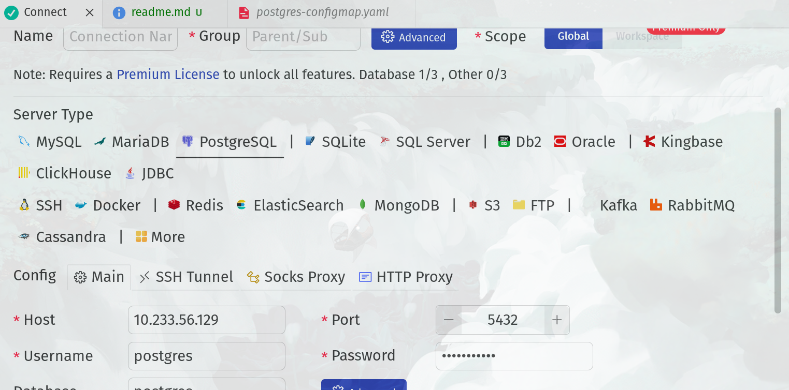

## Note for configmap 
Inside your cluster , you can connect your service with either clusterip:port , or FQDNS 
* Using clusterip 


* **FQDN- Fully Qualified Domain Name**
```bash
<service-name>.<ns>.svc.<cluster-name>
kubectl run -it dns-test --rm --restart=Never --image=busybox:1.36 sh
# inside the container , you can test to see if DNS is resolve or not 
nslookup FQDNS
postgres-svc.default.svc.mycluster
postgres-svc.default.svc.cluster.local
postgres-svc.default.svc.prod
postgres-svc.default.svc.cluster.prod 
mynginx-service.default.svc.mycluster
```