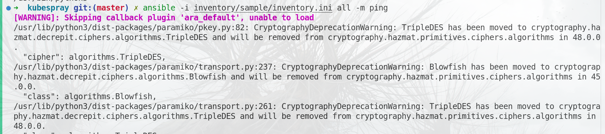

## NOTE 
>  Note for setting up the k8s clusters

- 3 masteres (8GB)
- 1 worker (4GB)


## 1. Run the playbook to create 4,5 machines 
```bash 
# inside kubespray 
cd kubespray 
pip install -r requirements.txt 
```
- Edit the inventory file for our infrastructures , it's located in here 
- `kubespray/inventory/sample/inventory.ini`

2. Define what need to installed inside our clusters 
    `kubespray/inventory/sample/groups_vars/k3s_cluster/addson.yaml`
    Chnage the addons for include these in the cluster setup
    - k8s_dashboard:true 
    - helm :true 
    - agrocd :true 
    - metric_server:true 
    - certmanager :true 
    - nginx-ingress-controller:true 
+ after the update you can run the command to start the cluster 
```bash 
cd kubespray
# To setup your HA cluster 
ansible-playbook -b -v -i inventory/sample/inventory.ini \
    cluster.yml

# to delete or reset your cluster 
ansible-playbook -b -v -i inventory/sample/inventory.ini \
    reset.yml
```

## After successful installation 
```bash
sudo kubectl get node 
sudo kubectl get node -o wide 
sudo kubectl get pod -A

```

## Type kubectl command without sudo 
```bash
mkdir -p $HOME/.kube
sudo cp -i /etc/kubernetes/admin.conf $HOME/.kube/config
sudo chown $(id -u):$(id -g) $HOME/.kube/config

```

## ISSUES
